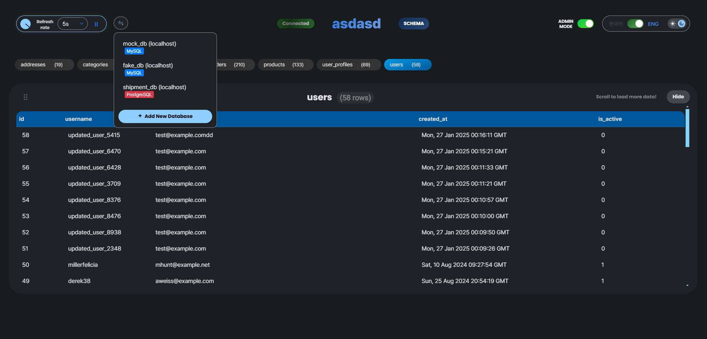

# uDBM - Realtime Database Monitor

<table>
<tr>
<td width="33.3333%">

</td>
<td width="66.6666%">

</td>
</tr>
</table>


A real-time database monitoring system that focus on monitoring tables' data. Available as both a **desktop application (Electron)** and **web application**. Monitor your MySQL and PostgreSQL databases with a modern, responsive interface.

## 🚀 Desktop Application (Electron)

### Download Portable Executable
- **Latest:** [Download Portable](https://github.com/nganlinh4/udbm/releases/latest) (94MB)
- No installation required - just download and run!

### Build from Source

#### Prerequisites
- Node.js 16+ ([Download](https://nodejs.org/))
- Python 3.8+ ([Download](https://www.python.org/))

#### Build Steps

```bash
# Clone repository
git clone https://github.com/nganlinh4/udbm.git
cd udbm

# Create and activate virtual environment
python -m venv venv
# Windows: venv\Scripts\activate
# Linux/Mac: source venv/bin/activate

# Install dependencies
npm install
pip install pyinstaller
pip install -r backend/requirements.txt

# Build portable executable
npm run build
# Output: release/uDBM-2.0.0-portable.exe
```

## 📁 Project Structure

```
udbm/
├── backend/          # Flask application
│   ├── static/      # Frontend assets
│   ├── templates/   # HTML templates
│   └── monitor.py   # Main Flask server
├── electron/        # Electron wrapper
│   ├── main.js     # Main process
│   └── preload.js  # Preload script
├── build-tools/     # Build configurations
│   └── monitor.spec # PyInstaller config
└── package.json     # Node.js dependencies
```

## Run as Web Application (Without Electron)

```bash
# Clone repository
git clone https://github.com/nganlinh4/udbm.git
cd udbm

# Create and activate virtual environment
python -m venv venv
# Windows: venv\Scripts\activate
# Linux/Mac: source venv/bin/activate

# Install Python dependencies
pip install -r backend/requirements.txt

# Activate the virtual environment
# Linux/Mac:
source venv/bin/activate
# Windows:
venv\Scripts\Activate.ps1

# Start the Flask server
python backend/monitor.py
```

Then open your browser to: `http://127.0.0.1:5080`

## Features

- Real-time monitoring for MySQL and PostgreSQL databases, at any scale
- Interactive schema visualization with relationships
- Real-time data view with auto-refresh
- Pause/Resume monitoring, configurable refresh rate
- Light/dark mode, English/Korean language support
- Quick swipe to toggle tables
- Custom configs that sticks to each database
- Secure connection management with cookie-based persistence
- Admin mode allowing add, delete, alter table data, and custom query directly from the interface

## Future Plans

(please recommend me more features)
- Support for more SQL types besides MySQL and PostgreSQL

## (Optional) Testing with Sample Databases

- `python backend/create_db.py`: Creates two sample databases (mock_db and fake_db) - one small and one large with predefined schemas. Use this if you want to quickly test the system without having any existing databases. Before running this, create a config.py in the backend folder to define your host, MySQL username, password.
- `python backend/simulation.py`: Simulates three basic database operations (insert, update, delete) on the sample databases (if successful, the monitor page will have indicating animations like the below).


### Server Settings

The monitor server runs on port 5080 by default. To change this, modify the port number at the end of `backend/monitor.py`

## Usage

1. Start the monitoring server:
```bash
cd backend
python monitor.py
```

2. Access the web interface:
   - Open your browser and navigate to `http://localhost:5080`
   - Add your database connection through the interface

### Swipe table pills
Quickly toggle multiple tables with swiping (table pills ordered smartly by their foreign keys, instead of alphabetically) 


### Changing Page Title

Modified page title will be remembered for each of your databases separately


### Viewing Historical Data

Just scroll down, the monitoring will automatically pause. It will auto resume when you scroll back up or collapse the table


### Add, Delete, Alter Data, Custom Query

When ADMIN MODE is turned on, the page will allow for executing custom queries or selecting data cell and do various actions to the DB while ignoring foreign key checks.


## License

MIT License

## Contributing

Contributions are welcome! Please feel free to submit a Pull Request.
