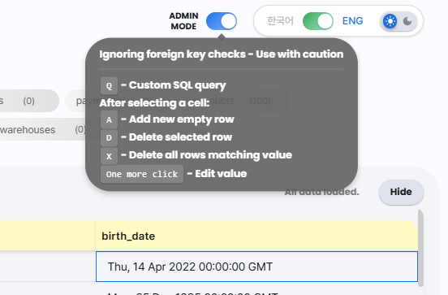

# uDBM - Realtime Database Monitor

<table>
<tr>
<td width="33.3333%">

</td>
<td width="66.6666%">

</td>
</tr>
</table>


A real-time web-based database monitoring system that focus on monitoring tables' data. You can use it for multiple databases, free and locally. Monitor your MySQL and PostgreSQL databases with a modern, responsive interface.

## Quick Installation

### Automated Installation (Recommended)

**Linux/macOS:**
```bash
./install.sh
./run.sh
```

**Windows:**
```cmd
install.bat
run.bat
```

Then open your browser to: `http://127.0.0.1:5046`

📖 **For detailed installation instructions, troubleshooting, and manual setup, see [INSTALL.md](INSTALL.md)**

## Features

- Real-time monitoring for MySQL and PostgreSQL databases, at any scale
- Interactive schema visualization with relationships using GraphViz andMermaid.js
- Real-time data view with auto-refresh
- Pause/Resume monitoring, configurable refresh rate
- Light/dark mode, English/Korean language support
- Quick swipe to toggle tables
- Custom configs that sticks to each database
- Secure connection management with cookie-based persistence
- Admin mode allowing add, delete, alter table data, and custom query directly from the interface

## Future Plans

(please recommend me more features)
- Support for more SQL types besides MySQL and PostgreSQL

## Installation

1. Clone the repository:
```bash
git clone udbm
cd udbm
```

2. Create and activate a virtual environment:
```bash
# Create virtual environment
python -m venv venv

# Activate virtual environment
# On Windows:
venv\Scripts\activate
# On macOS/Linux:
source venv/bin/activate
```

3. Install Python dependencies:
```bash
pip install -r requirements.txt
```

### (Optional) Testing with Sample Databases

- `python create_db.py`: Creates two sample databases (mock_db and fake_db, based on your defined `config.py`) - one small and one large with predefined schemas. Use this if you want to quickly test the system without having any existing databases. Before running this, go to config.py to define your host, MySQL username, password.
- `python simulation.py`: Simulates three basic database operations (insert, update, delete) on the sample databases (if successes, the monitor page will have indicating animations like the below).


### Server Settings

The monitor server runs on port 5046 by default. To change this, modify the port number at the end of `monitor.py`

## Usage

1. Start the monitoring server:
```bash
python monitor.py
```

2. Access the web interface:
   - Open your browser and navigate to `http://localhost:5046`
   - Add your database connection through the interface

### Swipe table pills
Quickly toggle multiple tables with swiping (table pills ordered smartly by their foreign keys, instead of alphabetically) 


### Changing Page Title

Modified page title will be remembered to each of your DB separatedly


### Viewing Historical Data

Just scroll down, the monitoring will automatically pauses, it will auto resume when you scroll back up or collapse the table


### Add, Delete, Alter Data, Custom Query

When ADMIN MODE is turned on, the page will allow for executing custom queries or selecting data cell and do various actions to the DB while ignoring foreign key checks.




## License

MIT License

## Contributing

Contributions are welcome! Please feel free to submit a Pull Request.
